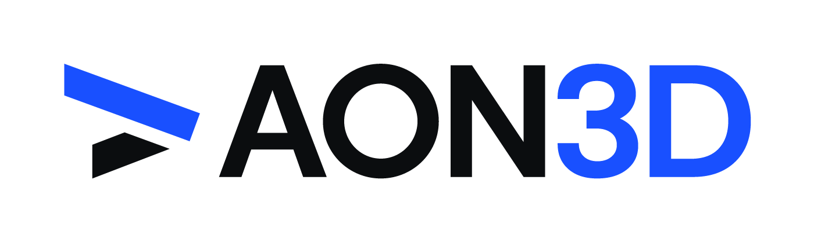

[](https://www.aon3d.com/)

# COVID-19 Face Shield

> Need 3D Printed Medical Supplies to Fight COVID-19?

TL;DR: [Here is what the model looks like](https://github.com/aon3d/covid-face-shield/blob/master/models/COVID-001-Face-Shield-Frame.STL).

The government of Canada has [recently come out with guidance](https://www.canada.ca/en/health-canada/services/drugs-health-products/medical-devices/covid-19-unconventional-manufacturing-personal-protective-equipment.html) regarding unconventional manufacturing of personal protective equipment in response to COVID-19.
As there are already many sites, forums, and social media efforts organizing people with access to 3D printers to support their local healthcare workers, we wanted to help standardize the design efforts.

To avoid medical professionals and our front line workers from having to adapt to a multitude of designs from different sources, we hope that grassroots efforts adopt a common design to minimize chances of a negative user experience.
As such, we are publishing our design, assembly instructions, MSDS, QC checklist, and all other documentation to help jumpstart others who want to get involved and help.

## How are we helping?

We are working with local health authorities in Montréal to produce desperately needed medical supplies and protective equipment.
Specifically, we are fabricating face shield to help protect our front line workers from splash and debris.

## Face Shield Design

Our face shield design is based on the [open-source work published by Georgia Tech](https://pwp.gatech.edu/rapid-response/face-shields/).
While the design is nearly identical, we have made the following modifications:

- Visor
  - Diameter of snap-on holes increased from 6.35mm to 7mm for an easier fit
- Frame
  - -0.25mm horizontal compensation
  - Thickness of 1/8" (3.175mm)

These modifications were done to better support our specialty, additive manufacturing, while also being compatible with future medium volume production methods, such as laser cutting.

## Design Files

All design files may be found in the [models](models/) folder.

- `DXF` files are for laser cutting
- `STL` files are for 3D printing
- `SLDPRT` and `STEP` files are for 3D CAD software (e.g., Solidworks, Inventor, Fusion 360)

## Documentation

All documentation files may be found in the [docs](docs/) folder.
PDFs of the documentation may be found [here](https://github.com/aon3d/covid-face-shield/releases/latest).

- Material Safety Data Sheets ([English](docs/msds-en.md) and [French](docs/msds-fr.md)) are available
- [Assembly instructions](docs/assembly.md)

## Development

### PDF Generation

#### Requirements

- [`pandoc`](https://pandoc.org/)
- `make`
- [`ghostscript`](https://www.ghostscript.com/)
- `texlive`

#### Procedure

To generate all PDFs:

```bash
make pdf
```

### Releases

- This repo uses [Calendar Versioning (`CalVer`)](https://calver.org/overview.html), with the following format: `YYYY.MM.DD`
- Generated PDFs should be attached to the [GitHub release](https://github.com/aon3d/covid-face-shield/releases/latest)
