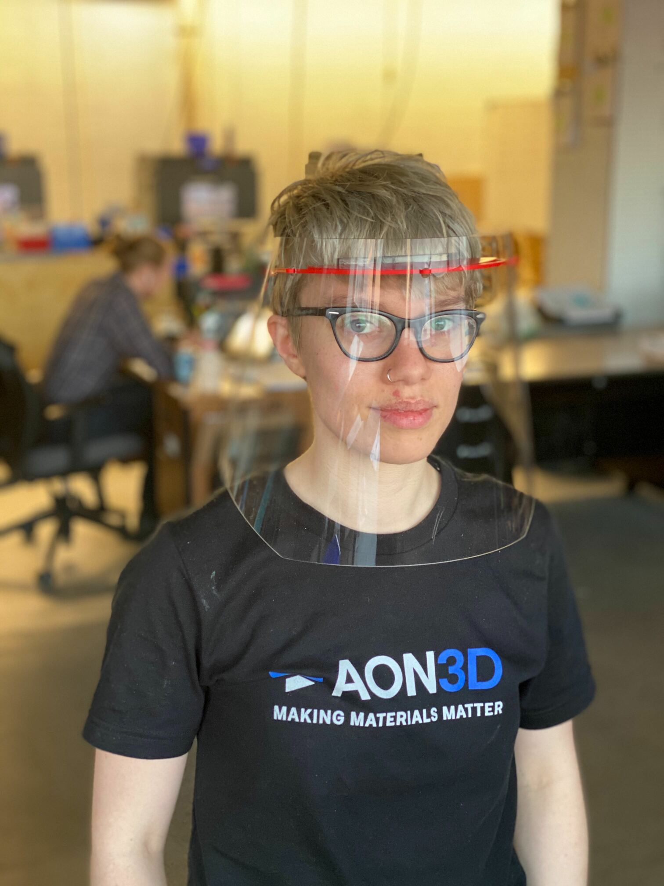

[](https://www.aon3d.com/)

# COVID-19 Face Shield

> [Need 3D Printed Medical Supplies to Fight COVID-19?](https://www.aon3d.com/3d-printed-medical-supplies-to-fight-covid-19/)

TL;DR: [Here is what the model looks like](https://github.com/aon3d/covid-face-shield/blob/master/models/COVID-001-Face-Shield-Frame.STL).

The government of Canada has [recently come out with guidance](https://www.canada.ca/en/health-canada/services/drugs-health-products/medical-devices/covid-19-unconventional-manufacturing-personal-protective-equipment.html) regarding unconventional manufacturing of personal protective equipment in response to COVID-19.
As there are already many sites, forums, and social media efforts organizing people with access to 3D printers to support their local healthcare workers, we wanted to help standardize the design efforts.

To avoid medical professionals and our front line workers from having to adapt to a multitude of designs from different sources, we hope that grassroots efforts adopt a common design to minimize chances of a negative user experience.
As such, we are publishing our design, assembly instructions, MSDS, QC checklist, and all other documentation to help jumpstart others who want to get involved and help.

## How are we helping?

We are working with local health authorities in Montréal to produce desperately needed medical supplies and protective equipment.
Specifically, we are fabricating face shield to help protect our front line workers from splash and debris.

Our design and manufacturing methodology focuses on fulfilling short-term needs using additive manufacturing (e.g., 3D printing) to act as a stopgap while organizing medium-volume manufacturing (e.g., laser cutting, die cutting).
This two-step approach leverages our expertise (additive manufacturing) as well as a robust and local supply chain.
In this way, urgent needs due to shortages can be successfully satisfied while large-volume manufacturing (e.g., molding) catches up.
As such, the chosen face shield design is optimized for both laser cutting and 3D printing.

<p>

</p>

## Contents

- [COVID-19 Face Shield](#covid-19-face-shield)
  - [How are we helping?](#how-are-we-helping)
  - [Contents](#contents)
  - [Face Shield Design](#face-shield-design)
    - [Requirements and Specifications](#requirements-and-specifications)
      - [Visor](#visor)
      - [Frame](#frame)
    - [Handling](#handling)
    - [Packaging](#packaging)
      - [Bag A (6” poly tubing)](#bag-a-6-poly-tubing)
      - [Bag B (12” poly tubing)](#bag-b-12-poly-tubing)
      - [Bag C (12” poly tubing)](#bag-c-12-poly-tubing)
      - [Box](#box)
  - [Design Files](#design-files)
  - [Documentation](#documentation)
  - [Printing Instructions](#printing-instructions)
    - [Printer Preparation](#printer-preparation)
    - [Frame Printing](#frame-printing)
    - [Frame Removal](#frame-removal)
  - [Development](#development)
    - [PDF Generation](#pdf-generation)
      - [Requirements](#requirements)
      - [Procedure](#procedure)
    - [Releases](#releases)

## Face Shield Design

Our face shield design is based on the [open-source work published by Georgia Tech](https://pwp.gatech.edu/rapid-response/face-shields/).
While the design is nearly identical, we have made the following modifications:

- Visor
  - Diameter of snap-on holes increased from 6.35mm to 7mm for an easier fit
- Frame
  - -0.25mm horizontal compensation
  - Thickness of 1/8" (3.175mm)
  - A [second iteration of the frame](models/COVID-001-Face-Shield-Frame_CNC_1_8-R01.STEP) is available and accommodates CNC milling with a 1/8" cutter

These modifications were done to better support our specialty, additive manufacturing, while also being compatible with future medium volume production methods, such as laser cutting and CNC milling.

### Requirements and Specifications

#### Visor

- Must provide adequate coverage (CSA Z94.3 Sections 10.2.1/10.2.2/10.3/10.4)
- Should made of optically clear, distortion free, lightweight materials (CSA Standard Z94.3.1-16)
- Should be free of visible defects or flaws that would impede vision (ANSI Z87.1 Section 9.4)
- Should allow adequate space between the wearer’s face and the inner surface of the visor to allow for the use of ancillary equipment (medical/surgical mask, respirator, eyewear, etc.)
- Device should withstand impact from sharp or fast projectiles (ANSI Z87.1 Section 9.2 and 9.3, CSA Z94.3 Section 10.1)
- Material: PC, PETG, PET, Acetal, POM, Polypropylene, or PVC
- Thickness: 0.01” - 0.03”

#### Frame

- Device should fit snugly to afford a good seal to the forehead area and to prevent slippage of the device
- User contacting materials should provide adequate material biocompatibility (skin sensitivity and cytotoxic testing) (ISO 10993-5, 10)
- Must resist isopropyl alcohol (IPA)
- Material: PC, ABS, or Acetal
- Thickness: 1/8" or 3/16"

### Bill of Materials

| Item | Qty | Comments |
|---|---|---|
| Frame | 1 | Laser cut or 3D printed |
| Visor | 1 | Laser or die cut |
| Elastic | 4+ | Size 33 (e.g., McMaster-Carr `12205T78`) |


### Handling

As it seems a person can carry the virus and be asymptomatic, it is best to act as if you may be contagious and take precautions to avoid contaminating the face shield during production.

- Wash your hands before entering the manufacturing area
- Wash your hands before removing prints
- Wipe down tools with IPA before using them to remove prints
- Wear a mask while handling prints
- Do not enter the manufacturing area unless you are the designated operator on shift
- Prints are immediately bagged after removal from the machine

### Packaging

To make the user experience as simple as possible for front line workers, the following packaging procedure is recommended:

#### Bag A (6” poly tubing)

- 40x elastics

#### Bag B (12” poly tubing)

- 10x frames

#### Bag C (12” poly tubing)

- 10x face shield kits
  - Bag A
  - Bag B
  - 10x visors
  - Assembly instructions

#### Box

 - MSDS
 - 10x Bag C

## Design Files

All design files may be found in the [models](models/) folder.

- `DXF` files are for laser cutting
- `STL` files are for 3D printing
- `SLDPRT` and `STEP` files are for 3D CAD software (e.g., Solidworks, Inventor, Fusion 360)
- `factory` files are for [Simplify3D](https://www.simplify3d.com/) and are designed to work for the [AON-M2 industrial 3D printer](https://www.aon3d.com/aon-m2-2020-industrial-3d-printer/)

## Documentation

All documentation files may be found in the [docs](docs/) folder.
PDFs of the documentation may be found [here](https://github.com/aon3d/covid-face-shield/releases/latest).

- Material Safety Data Sheets ([English](docs/msds-en.md), [French](docs/msds-fr.md) and [Spanish](docs/msds-es.md)) are available
- [Assembly instructions](docs/assembly.md)

## Printing Instructions


The following instructions are intended for printing using the AON-M2 or AON-M2 2020.

### Printer Preparation


1. Install a 0.6 mm nozzle heater block assembly. Instructions [here](https://docs.aon3d.com/maintenance/replace_hba/). 
2. Install the aluminum build plate. Ensure that the Kapton tape is in good condition on all the surfaces. (If not, follow [this procedure](https://docs.aon3d.com/maintenance/kapton_application/) to replace it. 
3. Clean the surface with IPA (isopropyl alcohol), minimum concentration of 70% for disinfection purposes.
4. Apply an adhesive to the build platform to ensure ABS adhesion. Dimafix or hairspray are tested adhesives for ABS.
4. Load ABS in the 0.6 mm toolhead you want to use. Instructions [here](https://docs.aon3d.com/operation/material_switch/).
5. Preheat the machine to the following temperatures:

| Component  | Temperature |  
|:----------:|:-----------:| 
| Build platform  | 105°C  | 
| Chamber    | 60°C        | 


6. Once the chamber has reached thermal equilibrium, initiate the probing sequence on the entire bed  and set the Z offset. Instructions [here](https://docs.aon3d.com/calibration/z_calibration/).

Use these probe bounds:

| Parameter  | Value |  
|:----------:|:-----:| 
| Left       | 15    | 
| Right      | 435   |
| X Count    | 10    |
| Front      | 15    |
| Back/Rear  | 435   |
| Y Count    | 10    |


### Frame Printing

We have included two generated G-code files that are ready for use on the AON-M2 and AON-M2-2020.
They are intended for use with ABS and a 0.6 mm nozzle.
One G-code file is specific for printing with T0 (left toolhead) and the other is for use with T1 (right toolhead).

If you wish to modify the files, the original factory files for use with Simplify 3D have been included.
However, the specified settings have been tested and any modification may cause print defects.

Each print will yield 5 face shield frames. 

Plan 112g of ABS filament and just over 2 hours of print time per print.


### Frame Removal

How to remove the part from the build platform. Proceed following the aformentioned [handling](#handling) guidelines. 

**The parts and machines are hot!**
- At the end of the print, the toolheads will move to the back of the machine for easy access to the printed frames.
- The toolheads, the build platform and the chamber will remain heated to allow for a quick restart.
- Remove the skirt (single outline of material).
- With the scraper, carefully detach the extremity of the face shield frame. This will initiate the rest of the removal. Gently detach the part by placing the scraper under the part.
- Place the parts in a sanitized bag for storage.

## Development

### PDF Generation

#### Requirements

- [`pandoc`](https://pandoc.org/)
- `make`
- [`ghostscript`](https://www.ghostscript.com/)
- `texlive`

#### Procedure

To generate all PDFs:

```bash
make pdf
```

### Releases

- This repo uses [Calendar Versioning (`CalVer`)](https://calver.org/overview.html), with the following format: `YYYY.MM.DD`
- Generated PDFs should be attached to the [GitHub release](https://github.com/aon3d/covid-face-shield/releases/latest)
